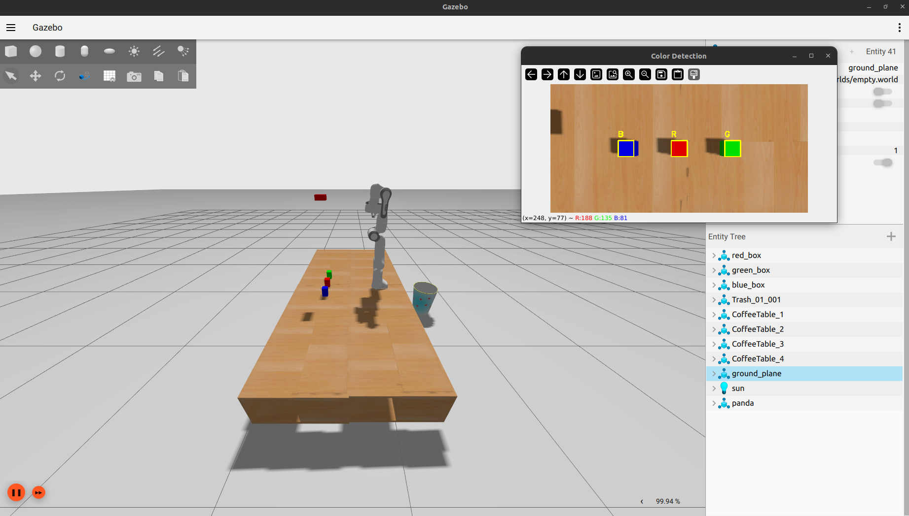

# Robotic Arm and OpenCV Color Detection

This project features a ROS 2 workspace simulating a Panda robotic arm (mounted on a scissor lift) performing color detection using OpenCV and automating a pick-and-place workflow.



<video src="images/video.webm" width="100%" controls autoplay loop></video>

## 📦 Packages Overview

The workspace (`robot_ws`) is functionally divided into the following packages:

- **`robot_bringup`**: Contains top-level launch files to initialize the simulation, controllers, and MoveIt environment. 
- **`robot_controller`**: Provides configurations and launch files for `ros2_control`, defining hardware interfaces and joint trajectory controllers.
- **`robot_description`**: Contains the URDF and Xacro models of the robot (arm and lift), 3D meshes, and Gazebo world files.
- **`robot_moveit`**: MoveIt 2 package with SRDF, kinematics configurations, and planning context for path planning and collision avoidance.
- **`robot_vision`**: A Python-based OpenCV node (`color_detector.py`) for detecting and localizing objects based on color.
- **`pymoveit2`**: Python MoveIt 2 bindings/scripts including the main `pick_and_place.py` application node.

## 🚀 Quick Start

### 1. Build the Workspace
To build the project, navigate to the root of the workspace and use `colcon`:
```bash
cd ~/robot_ws
# Note: --symlink-install currently causes issues with the pymoveit2 package.
colcon build 
source install/setup.bash
```

### 2. Launch the Simulation and Pick-and-Place Node
The main launch file brings up Gazebo, controllers, MoveIt, the vision node, and (optionally) the pick and place node.
```bash
ros2 launch robot_bringup pick_and_place.launch.py
```

## 🛠️ Known Issues and TODOs

### Build Errors
If you build the workspace using the `--symlink-install` flag, the `pymoveit2` package fails with the following error:
```
failed to create symbolic link '/home/atharva/robot_ws/build/pymoveit2/ament_cmake_python/pymoveit2/pymoveit2' because existing path cannot be removed: Is a directory
```
**Fix/Workaround:** Build the workspace without the `--symlink-install` flag, or delete the `build/` and `install/` folders and rebuild.

### Missing Metadata
Several `package.xml` files and Python `setup.py` scripts have default, placeholder metadata that should be updated to resolve ROS 2 linter warnings:
- `<description>TODO: Package description</description>`
- `<maintainer email="atharva@todo.todo">atharva</maintainer>`
- `<license>TODO: License declaration</license>`
